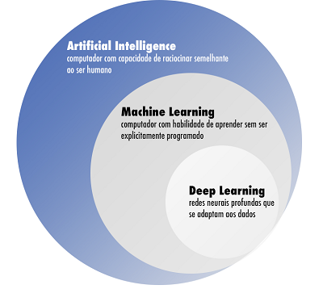

# Machine Learning
No aprendizado de máquina (Machine learning) dados de fatos que já aconteceram são processados pelo computador, a fim de encontrar um padrão, montar um modelo e assim prever acontecimentos do futuro.

## Tipos de algoritmos
#### Supervisionados
São ditos supervisionados quando existe uma classe ou um atributo especial com o qual se pode comparar e validar o resultado. Este processo acontece na fase de treinamento, antes de executá-lo efetivamente.
#### Não supervisionados
Não há um atributo fixo para comparar o resultado, a validação do resultado acontece a cada execução em produção, sendo que o próprio usuário irá direcionando o algoritmo na direção mais acertiva.

## Tarefas
#### Classificação
A Classificação é uma sub área do Machine Learning que atribui uma classe para uma nova observação a partir de diversas características/variáveis de observações passadas.
#### Regressão
Tem como principal objetivo verificar como certas variáveis de interesse influenciam uma variável resposta Y e criar um modelo matemático capaz de predizer valores de Y com base em novos valores de variáveis preditoras X.
#### Agrupamentos
Faz parte dos algoritmos não supervisionados e tem a finalidade de agrupar os dados de acordo com características incomuns.
#### Sistemas de recomendação
Analisa dados de produtos ou serviços consumidos por usuário e tenta recomendar novos produtos ou serviços que também satisfaça a vontade do usuário, com base no padrão dos dados já existentes. Também faz parte dos algoritmos não supervisionados.

## Tratamento de dados
### Categorical Encoding

Os algoritmos computacionais entendem apenas números, desta forma é necessário transformar categorias em números. Para este processo pode-se utilizar duas técnicas, Label enconding e One-hot enconding.

- Label enconding

A categoria é colocada em ordem alfabética e cada uma recebe um número, começando por 0. 
O problema deste modelo é que o algoritmo pode relacionar esta ordem de dados (valores) com uma ordem de grandeza, aonde os com numerações maiores podem ser consideredos mais importantes.

- One-hot enconding

Neste modelo cada categoria é transformada em um novo atributo, em uma nova coluna, e é utilizado um valor binário para informar a ocorrência. 
O problema deste modelo é que o valor dos atributos torna-se altamente privisíveis pois os atributos (colunas), que deveria ser independentes, ficarão altamente relacionados. Para resolver isto seria necessário remover uma das colunas.

#### Qual Técnica deve ser utilizada
|Label enconding|One-hot enconding|
|---------------|-----------------|
|Há uma ordem(prog. Junior, Pleno, Senior)|Não há uma ordem|
|Existe um grande número de categorias|O número de categorias é pequeno|

### Feature Scalling

Este processo acontece quando há a necessidade de transformar dados numéricos em representações diferentes de dados também numéricos. Utiliza-se as técnicas Padronização (Z-score) e Normalização (Min-Max)

- Padronização (Z-score)
    - Os dados são aproximados de média (zero) e desvio padrão 1.
    - Podem ser negativos.
    - Não afeta outliers.
    - Deve ser usado na maioria dos casos.
- Normalização (Min-Max)
    - Transforma para escala comum entre zero e 1 (impõe limites).
    - Usado em processamento de imagem e RNA.
    - Quando não sabemos a distribuição de dados.
    - Quando os dados precisam ser positivo (>=0).
    - Algoritmos não "requerem" dados normais.
    - Remove outliers pois impõe "limites".
#### Considerações sobre este modelo.
Não tem o objetivo necessariamente de melhorar o modelo. Em arvores de decisão não precisa de nenhum tipo de tratamento de dados. E não se aplicam a atributos categóricos já transformados.

## Redes neurais convulacionais
A imagem é transformada em uma matriz tridimencional, aonde cada pixel da imagem é convertido para um valor de 0 a 255, de acordo com a cor, e adicionado na matriz. Cada dimensão da matriz conterá o valor relativo ao RGB.
### Convovlution
Gera um mapa de características, buscando um padrão na imagem. Isto tem o objetivo de reduzir a quantidade de pixes tornando o processo mais rápido.
São criados vários mapas de características para formar a Convolutional Layer.

### Max Pooling
A partir do mapa de características é gerado um novo mapa em pool, capturando somente as características mais importantes. Isto reduz ainda mais o tamanho da imagem, preservando somente o que é importante.

### Flattening
Chamado de "achatamento" da imagem, transforma o mapa de características em pool em um array.

### Full Connection
Conexão totalmente conectada, aonde todos os neurónios são conectados com os das camadas subsequentes. Para a camada de entrada da rede é utilizado o Flattening gerado anteriormente e para a saída, terá um neurônio para cada característica que se deseja prever, por exemplo cachorro ou gato.

## Aprendizagem profunda
### Bibliotecas utilizadas

#### Tensorflow

É uma biblioteca de código aberto para aprendizado de máquina aplicável a uma ampla variedade de tarefas. É um sistema para criação e treinamento de redes neurais para detectar e decifrar padrões e correlações, análogo (mas não igual) à forma como humanos aprendem e raciocinam.

#### Keras

É uma biblioteca de rede neural de código aberto escrita em Python. Ele é capaz de rodar em cima de TensorFlow, Microsoft Cognitive Toolkit, R, Theano, ou PlaidML. Projetado para permitir experimentação rápida com redes neurais profundas, ele se concentra em ser fácil de usar, modular e extensível.

#### PyTorch

É uma biblioteca Python de aprendizado de máquina de código aberto usada para implementações de aprendizado profundo, como visão computacional (usando TorchVision) e processamento de linguagem natural.

#### Theano

É uma biblioteca Python que permite avaliar operações matemáticas, incluindo matrizes multidimensionais de forma eficiente. É usado principalmente na construção de Projetos de deep learning.

* Instalação

    > pip install tensorflow 
    > pip install keras 
    > pip install torch torchvision torchaudio 
    > pip install theano 
    > pip install matplotlib 
    > pip install pandas 
    > pip install sklearn</b>